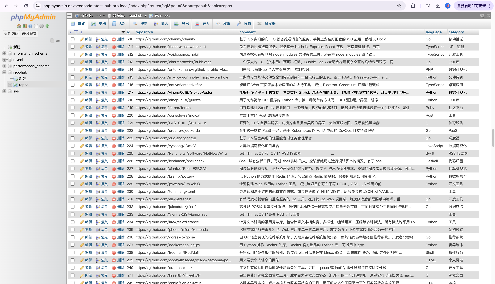

# DevSecOpsDataTest Hub
「开发、安全、运维、大数据、测试」平台汇总

🏔️ 随着项目越来越多，传统的表格无法满足多列联合过滤查询。是时候换一种数据组织形式了，我们将md表格换成了SQL语句。

```yml
services:
  db:
    image: mysql:8.0
    container_name: mysql-repohub
    restart: always
    environment:
      MYSQL_ROOT_PASSWORD: root
      MYSQL_DATABASE: repohub
      TZ: Asia/Shanghai
    ports:
      - "3306:3306"
    volumes:
      - ./init.sql:/docker-entrypoint-initdb.d/init.sql

  phpmyadmin:
    image: phpmyadmin
    container_name: phpmyadmin-repohub
    restart: always
    ports:
      - "8080:80"
    environment:
      PMA_HOST: db
      PMA_USER: root
      PMA_PASSWORD: root
      TZ: Asia/Shanghai

```

## ⛵️ 启动项目

 运行项目很简单，切换到项目根目录运行下面命令即可；

```bash
docker-compose up -d
```


